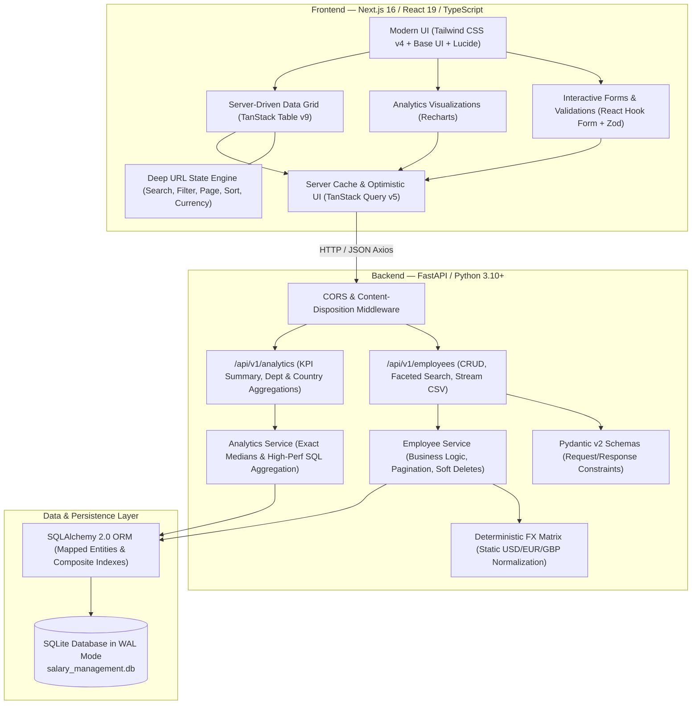

# 🌐 ACME Global Salary Management Platform

[](https://fastapi.tiangolo.com)
[](https://nextjs.org/)
[](https://react.dev/)
[](https://www.typescriptlang.org/)
[](https://www.python.org/)
[](https://sqlite.org/wal.html)
[](https://tailwindcss.com/)
[](https://tanstack.com/)
[](https://vitest.dev/)
[](https://pytest.org/)

> **Enterprise-Grade Global Workforce Compensation Intelligence & Management Platform**
> Engineered to replace fragmented spreadsheets for HR Managers, executives, and people operations teams across a **10,000+ employee global workforce**.

---

## 📌 Executive Summary

The **ACME Global Salary Management Platform** is a full-stack, high-performance web application designed to bring clarity, speed, and governance to global payroll operations. Managing international compensation across offices in the United States, United Kingdom, Germany, Canada, Japan, India, and beyond involves multi-currency volatility, complex departmental allocations, and slow spreadsheet updates.

ACME solves this by providing:

- **"How ACME Pays" Analytics**: Real-time analytical visibility into organizational payroll distributions, headcount densities, and median compensation across global regions.
- **Dual-Currency Intelligence**: Transparent side-by-side rendering of native local compensation alongside unified normalized currency benchmarks (USD, EUR, GBP) using deterministic FX normalization.
- **Sub-Second Scalability**: A high-density server-driven data grid supporting 10,000+ employee records with sub-200ms API response SLAs, full-text search, composite filtering, and deep URL state persistence.
- **Lifecycle HR Workflows**: Interactive modal experiences for employee creation/edits with live salary diff previews, CSV batch ingestion with client-side schema validation, salary adjustment audit histories, and optimistic soft-delete protections.

---

## 🏗️ System Architecture

The monorepo separates concerns into a modular **FastAPI** backend and an optimized **Next.js 16 (App Router)** frontend, integrated via REST API contracts with robust error resilience and deterministic data synchronization.



---

## ✨ Key Features & Highlights

| Domain                                  | Key Capabilities                                                                                                                                                                                                                                                                                                                                                                                                                                                                                                                                                              |
| :-------------------------------------- | :---------------------------------------------------------------------------------------------------------------------------------------------------------------------------------------------------------------------------------------------------------------------------------------------------------------------------------------------------------------------------------------------------------------------------------------------------------------------------------------------------------------------------------------------------------------------------- |
| 📊**Compensation Analytics**      | • Real-time KPI metrics strip (Total Payroll, Avg Base, Exact Median, Active Headcount).• Departmental expenditure bar charts with interactive hover cards.• Geographic headcount density and spend distribution maps across operating countries.                                                                                                                                                                                                                                                                                                                          |
| ⚡**High-Density Data Grid**      | • Server-side manual pagination, multi-column sorting, and faceted multi-filtering.• 300ms debounced global full-text search across employee names, titles, and emails.• Zero-CLS skeleton loaders, empty state recovery, and isolated error boundaries.                                                                                                                                                                                                                                                                                                                   |
| 💱**Dual-Currency Normalization** | • Renders native local pay (`£75,000 + £5,000`) beside normalized benchmarks (`$98,250 USD`).• Global header currency switcher toggling normalized display across `USD ($)`, `EUR (€)`, and `GBP (£)`.• Deterministic static FX lookup matrix guaranteeing zero network lag or third-party API failures.                                                                                                                                                                                                                                                     |
| 🛠️**HR Lifecycle Workflows**    | •**Add / Edit Modal**: Two-column responsive form powered by React Hook Form + Zod.• **Live Salary Diff Preview**: Instant visual preview of percentage and absolute pay adjustments (e.g., `$120,000 → $135,000 (+12.5%)`).• **Salary History Drawer**: Chronological audit trail showing past compensation changes.• **Batch CSV Ingestion**: Drag-and-drop file upload with 5-row schema preview prior to persistence.• **Soft-Delete with Rollback**: Destructive alert confirmation with optimistic UI removal and toast rollback. |
| 🚀**Performance & Reliability**   | •**SQLite Concurrency**: Write-Ahead Logging (`PRAGMA journal_mode=WAL;`) with 5000ms busy timeout.• **Streaming CSV Export**: Chunked generator stream without in-memory buffering.• **High-Cardinality Indexes**: Composite indices on `(department, is_deleted)`, `(country, is_deleted)`, and `salary_usd`.                                                                                                                                                                                                                                  |

---

## 📁 Repository Structure

```text
Incubyte/
├── backend/                        # High-performance FastAPI REST API
│   ├── app/
│   │   ├── constants/              # Static FX rates conversion matrix
│   │   ├── routers/                # HTTP route handlers (employees, analytics)
│   │   ├── services/               # Business logic, SQL aggregations, and streaming
│   │   ├── config.py               # Pydantic environment configuration
│   │   ├── database.py             # SQLAlchemy 2.0 engine & SQLite WAL config
│   │   ├── models.py               # Employee database models & composite indexes
│   │   ├── schemas.py              # Pydantic v2 validation schemas
│   │   └── main.py                 # FastAPI application root & CORS middleware
│   ├── scripts/
│   │   ├── seed.py                 # 10,000 employee Faker batch seeder (<2s execution)
│   │   └── benchmark.py            # Latency benchmark suite (<200ms verification)
│   ├── tests/                      # Pytest unit, integration, and router test suites
│   ├── context/                    # Architectural guidelines & context documentation
│   ├── prompts/                    # Implementation prompt logs & specs
│   ├── requirements.txt            # Python dependencies
│   └── README.md                   # Backend-specific documentation
│
├── frontend/                       # Modern Next.js 16 & React 19 Web Application
│   ├── __tests__/                  # Vitest suites (46 unit, component & integration tests)
│   ├── app/                        # Next.js App Router (Layout, Providers, Page, Styles)
│   ├── components/                 # Modular UI components (Analytics, Grid, Modals, UI)
│   ├── context/                    # Product specification & architectural standards
│   ├── hooks/                      # Custom React hooks (useCurrency, useDebounce, URL sync)
│   ├── lib/                        # Axios client, mock engine, types, and Zod schemas
│   ├── prompts/                    # Feature prompt artifacts & implementation notes
│   ├── package.json                # Frontend dependencies & scripts
│   ├── vitest.config.ts            # Vitest & Happy-DOM test runner configuration
│   └── README.md                   # Frontend-specific documentation
│
└── README.md                       # Master repository documentation (this file)
```

---

## 🛠️ Technology Stack Matrix

### Backend

- **Core Framework**: [FastAPI 0.110+](https://fastapi.tiangolo.com/) with [Uvicorn](https://www.uvicorn.org/)
- **ORM & Data Layer**: [SQLAlchemy 2.0](https://www.sqlalchemy.org/) with [SQLite 3 (WAL Mode)](https://sqlite.org/wal.html)
- **Validation & Settings**: [Pydantic v2](https://docs.pydantic.dev/) & `pydantic-settings`
- **Data Generation**: [Faker](https://faker.readthedocs.io/) for synthetic multi-national dataset generation
- **Testing**: [Pytest](https://pytest.org/), [pytest-asyncio](https://pytest-asyncio.readthedocs.io/), and [HTTPX](https://www.python-httpx.org/)

### Frontend

- **Framework**: [Next.js 16](https://nextjs.org/) (App Router), [React 19](https://react.dev/), [TypeScript 5](https://www.typescriptlang.org/)
- **Styling**: [Tailwind CSS v4](https://tailwindcss.com/) with dark/light mode token architecture
- **Component Primitives**: [Base UI](https://base-ui.com/) / [Radix UI](https://www.radix-ui.com/), [Lucide React](https://lucide.dev/), [Sonner](https://sonner.emilkowal.ski/)
- **State & Caching**: [TanStack React Query v5](https://tanstack.com/query/latest) (optimistic mutations, stale-while-revalidate)
- **Data Grid**: [TanStack React Table v9](https://tanstack.com/table/latest) (server-driven manual pagination/sorting)
- **Forms & Validation**: [React Hook Form](https://react-hook-form.com/) + [Zod](https://zod.dev/)
- **Visualizations**: [Recharts 3](https://recharts.org/)
- **Testing**: [Vitest 4](https://vitest.dev/), [React Testing Library](https://testing-library.com/), [MSW](https://mswjs.io/), [Happy-DOM](https://github.com/capricorn86/happy-dom)

---

## 🚀 Quickstart & Setup Guide

### Prerequisites

- **Python**: `3.10` or higher (tested on Python 3.14)
- **Node.js**: `v20.x` or `v22.x` (LTS recommended)
- **Package Manager**: `npm` (v10+), `pnpm`, or `yarn`

---

### 1. Backend Setup

```bash
# Navigate to the backend directory
cd backend

# Create and activate a Python virtual environment
# Windows (PowerShell):
python -m venv .venv
.venv\Scripts\Activate.ps1

# Linux / macOS:
python3 -m venv .venv
source .venv/bin/activate

# Install dependencies
pip install -r requirements.txt

# Seed database with 10,000 employee records (<2 seconds)
python -m scripts.seed

# Start FastAPI development server
uvicorn app.main:app --reload --port 8000
```

> 📖 **API Docs**: Access interactive OpenAPI / Swagger documentation at [http://localhost:8000/docs](http://localhost:8000/docs).

---

### 2. Frontend Setup

```bash
# Open a new terminal and navigate to the frontend directory
cd frontend

# Install Node dependencies
npm install

# Start Next.js development server
npm run dev
```

> 🌐 **Web App**: Open [http://localhost:3000](http://localhost:3000) in your browser.

---

## 📡 API Specification Summary

| Method     | Endpoint                          | Description                                        | Query Parameters / Highlights                                                                                           |
| :--------- | :-------------------------------- | :------------------------------------------------- | :---------------------------------------------------------------------------------------------------------------------- |
| `GET`    | `/health`                       | Application health and database connectivity check | —                                                                                                                      |
| `GET`    | `/api/v1/employees`             | Paginated, filtered, and sorted employee dataset   | `page`, `page_size`, `search`, `department`, `country`, `status`, `currency`, `sort_by`, `sort_order` |
| `POST`   | `/api/v1/employees`             | Create a new employee record                       | Validated JSON payload with automatic FX normalization                                                                  |
| `GET`    | `/api/v1/employees/{id}`        | Retrieve individual employee details               | Returns 404 for deleted or non-existent records                                                                         |
| `PUT`    | `/api/v1/employees/{id}`        | Update existing employee record                    | Recalculates normalized`salary_usd` on compensation edits                                                             |
| `DELETE` | `/api/v1/employees/{id}`        | Soft-delete employee                               | Sets`is_deleted = true`, preserving historic audit integrity                                                          |
| `GET`    | `/api/v1/employees/export/csv`  | Memory-efficient streaming CSV export              | Honors active search and faceted filter parameters                                                                      |
| `GET`    | `/api/v1/analytics/summary`     | Organization-wide compensation KPIs                | Total payroll, average salary, exact median, active count                                                               |
| `GET`    | `/api/v1/analytics/departments` | Departmental compensation & headcount metrics      | Aggregated total spend and average salary per department                                                                |
| `GET`    | `/api/v1/analytics/countries`   | Geographic spend distribution & density            | Country-level headcount and total payroll breakdown                                                                     |

---

## 🧪 Testing & Verification

Both frontend and backend contain comprehensive automated test suites ensuring zero regressions and rock-solid reliability:

### Backend Testing (Pytest)

```bash
cd backend
pytest -v
```

- **Unit Tests**: Deterministic FX calculations, input constraints, exact median calculations.
- **Integration Tests**: Employee CRUD operations, search filters, pagination offsets, and CSV streaming headers.
- **Analytics Tests**: Multi-currency aggregations and soft-delete exclusion verification.
- **Performance Benchmarks**: `python -m scripts.benchmark` verifying sub-200ms query SLA over 10,000 records.

### Frontend Testing (Vitest & React Testing Library)

```bash
cd frontend
npm run test
```

- **Validation Tests (15 tests)**: Zod schema rules, negative salary boundaries, email formats, and CSV row parsing.
- **Math & Currency Tests (18 tests)**: Salary diff calculations (+/- percentage changes), currency formatting, and edge cases.
- **Component Tests (10 tests)**: Data table sorting/pagination, Add/Edit modal states, dynamic diff card triggers.
- **Integration Tests (3 tests)**: MSW-mocked optimistic mutations and server state cache invalidations.

---

## 👥 Contributors & Acknowledgments

This project was built through a collaborative, spec-driven engineering methodology combining human direction, autonomous AI pair programming, rigorous automated code review, and organizational guidance:

- **GrantLinkz** — *Project Lead & Software Engineer*Directed system architecture, product specification, technical requirements, code curation, and end-to-end implementation across backend and frontend domains.
- **Incubyte** — *Project Organization & Evaluation*Provided the technical assessment framework, real-world business context, evaluation criteria, and organizational problem statement.
- **Antigravity IDE with Gemini** — *Autonomous AI Agentic Pair Programmer & Technical Co-Pilot*Collaborated on spec-driven architectural design, implementation workflows, boilerplate generation, high-density component engineering, and end-to-end automated test suites.
- **CodeRabbit** — *Automated AI Code Reviewer*
  Provided continuous automated code reviews, catching edge cases, enforcing best practices, and ensuring strict compliance with engineering standards.

---

## 📄 License

This repository is maintained as part of an engineering assessment and demonstration of spec-driven, agentic full-stack software development. All rights reserved.
