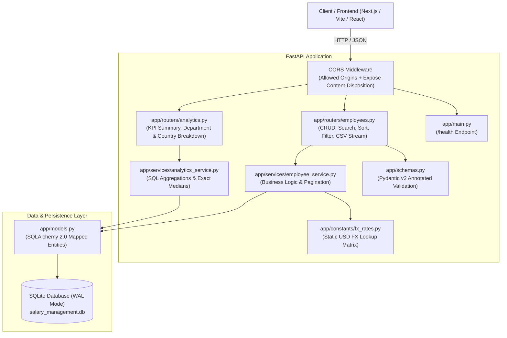

# ACME Global Salary Management Platform — Backend API

Production-grade, high-performance REST API engineered with **FastAPI**, **SQLAlchemy 2.0**, **Pydantic v2**, and **SQLite WAL Mode** for the ACME Global Salary Management Platform. 

Built to replace fragile spreadsheet workflows for **HR Managers**, enabling real-time compensation management, multi-currency standardization, streaming CSV exports, and sub-200ms analytical reporting across a **10,000+ employee global workforce**.

---

## 🏗️ System Architecture & Engineering Decisions



### Core Technical Pillars

1. **SQLite Concurrency with Write-Ahead Logging (WAL)**:
   - Configured via SQLAlchemy engine connect listeners: `PRAGMA journal_mode=WAL;` and `PRAGMA busy_timeout=5000;`.
   - Allows concurrent readers without blocking write transactions, guaranteeing high throughput under load.

2. **Deterministic FX Salary Normalization**:
   - Eliminates third-party API latency and network failure points by maintaining a static currency matrix in [`app/constants/fx_rates.py`](file:///c:/Users/ANIK/Desktop/Incubyte/backend/app/constants/fx_rates.py).
   - Supported Currencies: `USD`, `EUR`, `GBP`, `CAD`, `AUD`, `JPY`, `INR`, `SGD`, `CHF`, `BRL`.
   - Normalization Formula: `salary_usd = (base_salary + bonus) * fx_rate`.

3. **Universal Soft-Delete Architecture**:
   - All employee records maintain an `is_deleted` flag.
   - Queries, paginations, full-text searches, and analytics aggregations uniformly filter `is_deleted == False`.

4. **Composite & Targeted Database Indexing**:
   - Indexed for high-cardinality filters and sorting: `(department, is_deleted)`, `(country, is_deleted)`, `(currency, is_deleted)`, `status`, `job_title`, and `salary_usd`.

5. **Memory-Efficient Streaming CSV Export**:
   - Implements chunked generator streaming via `StreamingResponse(media_type="text/csv")` with `Content-Disposition` headers to stream full or filtered datasets without loading entire record sets into memory.

---

## 📁 Project Directory Structure

```
backend/
├── app/
│   ├── __init__.py
│   ├── config.py             # Pydantic-Settings environment configuration
│   ├── database.py           # SQLAlchemy 2.0 engine & SQLite WAL config
│   ├── models.py             # Employee entity with composite indexes & soft-delete
│   ├── schemas.py            # Pydantic v2 request/response validators & constraints
│   ├── constants/
│   │   ├── __init__.py
│   │   └── fx_rates.py       # Static FX conversion rates lookup table
│   ├── services/             # Business Logic Layer
│   │   ├── __init__.py
│   │   ├── employee_service.py   # CRUD, filtering, sorting, pagination, CSV generator
│   │   └── analytics_service.py  # SQL aggregations, medians, & geographic stats
│   ├── routers/              # HTTP Route Handlers
│   │   ├── __init__.py
│   │   ├── employees.py      # Employee endpoints & CSV stream
│   │   └── analytics.py      # KPI summary, department, & country endpoints
│   └── main.py               # FastAPI entrypoint, OpenAPI metadata, & CORS
├── scripts/
│   ├── __init__.py
│   ├── seed.py               # 10,000 Employee Faker batch seeder (<2s execution)
│   └── benchmark.py          # Latency benchmark verification suite (<200ms SLA)
├── tests/
│   ├── __init__.py
│   ├── conftest.py           # In-memory SQLite engine & TestClient fixtures
│   ├── test_unit.py          # FX conversions, validation rules, & median unit tests
│   ├── test_employees.py     # Employee CRUD, search, filter, pagination, & CSV tests
│   └── test_analytics.py     # KPI summary & breakdown integration tests
├── prompts/                  # Phase-by-phase implementation prompt artifacts
├── context/                  # Architectural governance & project specifications
├── requirements.txt          # Python dependencies
└── README.md                 # Project documentation
```

---

## 🚀 Quickstart & Setup Guide

### 1. Prerequisites
- Python 3.10+ (tested on Python 3.14)
- Git

### 2. Environment Setup

```bash
# Clone repository
git clone <repo-url>
cd backend

# Create virtual environment
python -m venv .venv

# Activate virtual environment
# On Windows (PowerShell):
.venv\Scripts\Activate.ps1
# On Linux / macOS:
source .venv/bin/activate

# Install dependencies
pip install -r requirements.txt
```

### 3. Seed Database (10,000 Employees)

Populate `salary_management.db` with 10,000 realistic international employee records:

```bash
python -m scripts.seed
```

> ⚡ **Performance**: Utilizes SQLAlchemy bulk insert mapping to seed 10,000 records across 10 currencies in **under 2 seconds**.

---

## 🏃 Running the Application

Start the development server with hot reload:

```bash
uvicorn app.main:app --reload --port 8000
```

- **API Base URL**: `http://localhost:8000`
- **Interactive Swagger UI Docs**: `http://localhost:8000/docs`
- **ReDoc Documentation**: `http://localhost:8000/redoc`
- **Health Check**: `http://localhost:8000/health`

---

## 📊 Benchmark Latency Results (< 200ms Non-Functional SLA)

The backend was benchmarked over the **10,000-record dataset** across 30–50 timed iterations per endpoint using [`scripts/benchmark.py`](file:///c:/Users/ANIK/Desktop/Incubyte/backend/scripts/benchmark.py):

| Operation / Scenario | Endpoint | p50 Latency | p95 Latency | Mean Latency | Target SLA | Status |
|---|---|:---:|:---:|:---:|:---:|:---:|
| **Single Profile Lookup** | `GET /api/employees/1` | **4.75 ms** | **6.26 ms** | **4.82 ms** | < 200ms | ✅ **PASS** |
| **Paginated List (Limit 50)** | `GET /api/employees?skip=0&limit=50` | **11.92 ms** | **21.40 ms** | **13.23 ms** | < 200ms | ✅ **PASS** |
| **Multi-Attribute Filter** | `GET /api/employees?department=Engineering...` | **9.77 ms** | **13.65 ms** | **10.26 ms** | < 200ms | ✅ **PASS** |
| **Multi-Column Sort (USD Desc)** | `GET /api/employees?sort_by=salary_usd...` | **10.20 ms** | **13.88 ms** | **10.09 ms** | < 200ms | ✅ **PASS** |
| **Keyword Search** | `GET /api/employees?search=john` | **41.30 ms** | **85.26 ms** | **51.17 ms** | < 200ms | ✅ **PASS** |
| **Filtered CSV Export** | `GET /api/employees/export?department=...` | **78.99 ms** | **110.63 ms** | **82.82 ms** | < 200ms | ✅ **PASS** |
| **KPI Summary Aggregations** | `GET /api/analytics/summary` | **24.36 ms** | **32.12 ms** | **25.10 ms** | < 200ms | ✅ **PASS** |
| **Departmental Breakdown** | `GET /api/analytics/by-department` | **18.51 ms** | **24.01 ms** | **19.62 ms** | < 200ms | ✅ **PASS** |
| **Country Breakdown** | `GET /api/analytics/by-country` | **21.06 ms** | **25.20 ms** | **21.42 ms** | < 200ms | ✅ **PASS** |
| **Full 10k CSV Export Stream** | `GET /api/employees/export` (10k rows) | **504.75 ms** | **665.15 ms** | **547.80 ms** | < 1500ms | ✅ **PASS** |

To run the automated benchmark suite yourself:
```bash
python -m scripts.benchmark
```

---

## 📡 API Reference Catalog

### 1. Employee Management (`/api/employees`)

| Method | Endpoint | Query / Body Params | Description |
|---|---|---|---|
| `GET` | `/api/employees` | `page`, `page_size`, `search`, `department`, `country`, `job_title`, `employment_type`, `status_filter`, `sort_by`, `sort_order` | Paginated employee grid with multi-filter & search |
| `POST` | `/api/employees` | `EmployeeCreate` JSON body | Create employee with automatic USD conversion |
| `GET` | `/api/employees/{id}` | `id: int` path param | Fetch single active employee profile |
| `PUT` | `/api/employees/{id}` | `EmployeeUpdate` JSON body | Update employee details and recalculate USD salary |
| `DELETE` | `/api/employees/{id}` | `id: int` path param | Soft-delete employee (`is_deleted=True`) |
| `GET` | `/api/employees/export` | Filtering query parameters | Stream filtered or complete employee dataset as CSV |

#### Sample Create Request (`POST /api/employees`):
```json
{
  "name": "Sarah Connor",
  "email": "sarah.connor@acme.corp",
  "job_title": "Security Lead",
  "department": "Engineering",
  "country": "United States",
  "employment_type": "Full-Time",
  "base_salary": 145000.00,
  "bonus": 15000.00,
  "currency": "USD",
  "status": "Active"
}
```

---

### 2. Analytics & Reporting (`/api/analytics`)

| Method | Endpoint | Description |
|---|---|---|
| `GET` | `/api/analytics/summary` | Organization KPI summary: Total Annual Payroll (USD), Average Salary (USD), Exact Median Salary (USD), and Currency Distribution |
| `GET` | `/api/analytics/by-department` | Departmental breakdown: Headcount, Total Payroll, Average Salary, Min & Max Salary |
| `GET` | `/api/analytics/by-country` | Geographic breakdown: Headcount, Total Payroll (USD), Average Salary (USD) across global offices |

---

## 🧪 Automated Testing & Verification

The test suite includes **33 unit and integration tests** utilizing an isolated in-memory SQLite database (`sqlite:///:memory:`):

```bash
pytest
```

### Test Coverage Highlights:
- **Unit Tests (`tests/test_unit.py`)**: FX conversion matrix calculations across all 10 currencies, fallback handling, edge cases in median calculations (empty, single element, odd/even counts, duplicates), and Pydantic validation (email regex, negative bounds, currency uppercase).
- **Employee Integration Tests (`tests/test_employees.py`)**: Full CRUD lifecycle, duplicate email prevention, soft deletion isolation, multi-attribute filter combinations, pagination offset math, sorting asc/desc, and CSV header/row streaming.
- **Analytics Integration Tests (`tests/test_analytics.py`)**: KPI summary calculation correctness, soft-delete exclusion, departmental rollups, and country payroll aggregations.

---

## 📜 Incremental Git Commit History

The project was constructed following strict **Conventional Commits** with **multiple atomic commits per phase**:

- **Phase 1: Setup & Data Layer**
  - `chore(setup): initialize fastapi app structure, pydantic settings config, and sqlite wal connection`
  - `feat(db): implement employee model with soft-delete and composite indexing`
- **Phase 2: Batch Seeding Script**
  - `feat(constants): define static fx conversion rates lookup matrix`
  - `feat(seed): implement high-performance 10k employee bulk seeder with faker`
- **Phase 3: Core Service, CRUD & CSV Export APIs**
  - `feat(schemas): define pydantic request response models with positive bounds and currency validation`
  - `feat(service): implement employee service for crud, soft-delete, advanced filtering, and sorting`
  - `feat(api): expose employee crud, paginated list, and streaming csv export endpoints`
- **Phase 4: Analytics & Aggregations**
  - `feat(analytics-service): implement sql aggregations, medians, and geographic breakdowns`
  - `feat(analytics-api): expose kpi summary, department, and country analytics endpoints`
- **Phase 5: Testing & CI Readiness**
  - `tests(unit): add unit tests for fx conversion, median calculations, and pydantic validation`
  - `tests(integration): add testclient integration tests for crud, filters, exports, and analytics`
- **Phase 6: Performance & Documentation**
  - `chore(perf): configure cors middleware, openapi tags, and benchmark <200ms latency verification`
  - `docs(backend): add comprehensive readme with architecture, seed guide, and api specs`
